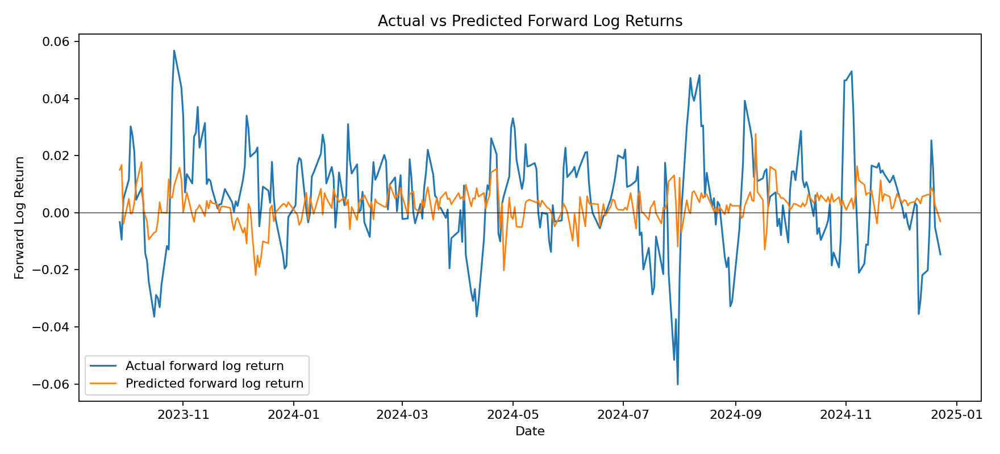
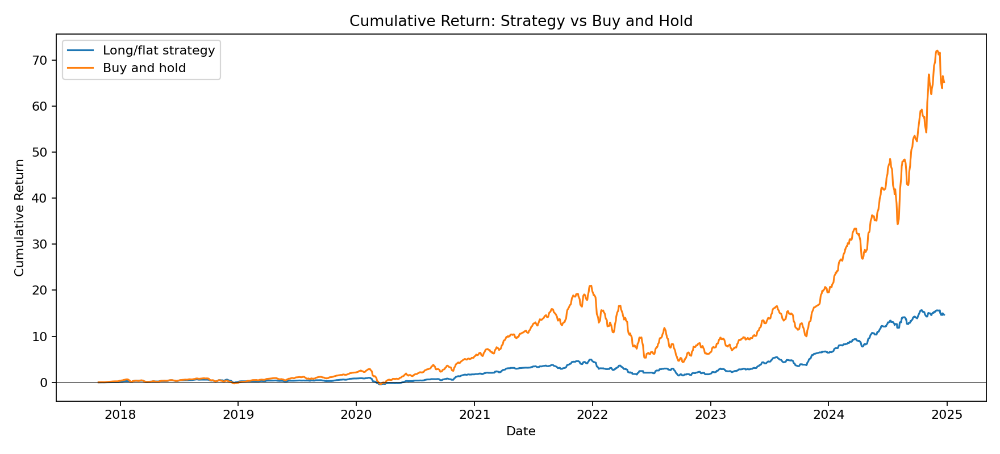
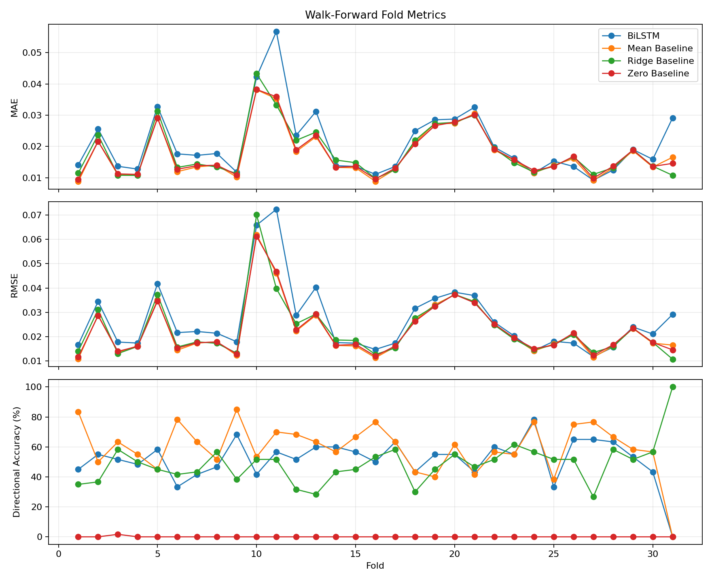

# BiLSTM Stock Forecasting: Short-Horizon Return Prediction

This project is a quant-style machine learning workflow for forecasting short-horizon equity returns. It intentionally avoids the common "predict the stock price" framing and instead models the 5-day forward log return of SPY from historical OHLCV-derived features.

The goal is not to claim a profitable trading system. The goal is to demonstrate a disciplined financial ML process: leakage-aware preprocessing, chronological validation, baseline comparisons, walk-forward testing, and honest interpretation of weak or unstable signals.

## TL;DR

- Predicts 5-day forward log returns for SPY, not raw stock prices.
- Uses a PyTorch BiLSTM with chronological splits, train-only scaling, and expanding-window walk-forward validation.
- Benchmarks against zero, mean-return, and Ridge baselines instead of evaluating the neural network in isolation.
- Key takeaway: in this setup, simple baselines are hard to beat, and the BiLSTM does not show robust outperformance.

## Key Results

Walk-forward full-timeline results are the main benchmark because they better reflect repeated out-of-sample forecasting.

| Model | MAE | RMSE | Directional Accuracy | Sharpe |
|---|---:|---:|---:|---:|
| Mean baseline | 0.017701 | 0.025390 | 61.30% | 3.90 |
| BiLSTM | 0.020567 | 0.030070 | 53.36% | 3.26 |

The BiLSTM is more complex, but it does not outperform the mean baseline on these metrics. The Sharpe values come from the diagnostic long/flat evaluation and should be interpreted carefully because the strategy compounds overlapping 5-day forward returns.

## Example Plots

Prediction versus realized forward returns:



Walk-forward cumulative long/flat diagnostic versus buy-and-hold:



Walk-forward fold-level metric evolution:



Feature ablation diagnostics are generated at `outputs/metrics/feature_ablation.csv` and `outputs/plots/feature_ablation.png`.

## What Is Predicted

For each date `t`, the target is:

```text
target_t = log(Close[t + 5] / Close[t])
```

This is a 5-trading-day forward log return, not a raw price level. Predicting returns is more appropriate for this type of project because prices are non-stationary and raw price forecasts can look impressive while being statistically weak.

The model receives a rolling sequence of the previous `lookback` days of engineered features and predicts one forward return.

## Pipeline Overview

1. Download SPY OHLCV data with `yfinance`.
2. Build technical and statistical features from historical price and volume data.
3. Construct the 5-day forward log-return target.
4. Split data chronologically.
5. Fit feature scaling on training data only.
6. Train a PyTorch BiLSTM regressor with early stopping.
7. Compare against simple baselines.
8. Evaluate on a fixed holdout split and with expanding-window walk-forward validation.
9. Generate diagnostic prediction, error, cumulative return, and fold-metric plots.

## Leakage Controls

The project is structured to avoid common financial ML leakage mistakes:

- No random train/test split is used.
- Feature scaling is fit only on the relevant training window.
- Walk-forward folds retrain using only past data.
- Target demeaning, when enabled, uses only the training target mean for that split or fold.
- Baselines use training-window information only where a learned value is required.
- The target is shifted forward after features are computed from current and historical observations.

The BiLSTM uses a fixed historical lookback window. Validation and test rows remain chronologically after training rows.

## Features

The feature set is intentionally simple and explainable:

- 1-day, 5-day, and 10-day log returns
- 10-day and 30-day realized volatility
- 10-day and 30-day momentum
- RSI
- simple moving-average gaps
- exponential moving-average gaps
- high-low range
- open-close return
- volume change
- volume ratio versus recent average volume

These are not claimed to be novel alpha factors. They are transparent inputs for testing whether a sequence model can extract useful short-term structure.

## Models And Baselines

Main model:

- BiLSTM regressor in PyTorch

Baselines:

- Zero-return baseline
- Training-mean return baseline
- Ridge regression baseline in walk-forward evaluation

The baselines are important. In noisy return prediction, a model that does not beat simple baselines is not providing convincing predictive value, even if it produces visually plausible forecasts.

## Evaluation

### Fixed Chronological Split

The fixed split trains once on the earliest observations, validates on the next block, and evaluates on the final held-out test block.

Latest fixed-split test metrics:

| Model | MAE | RMSE | MAPE | Directional Accuracy | Correlation |
|---|---:|---:|---:|---:|---:|
| Zero baseline | 0.014505 | 0.018616 | 100.00% | 0.00% | 0.0000 |
| Mean baseline | 0.014054 | 0.018220 | 109.99% | 66.45% | 0.0000 |
| BiLSTM | 0.014760 | 0.018896 | 177.35% | 58.15% | 0.0027 |

On this run, the BiLSTM does not outperform the mean-return baseline on MAE or RMSE.

### Walk-Forward Evaluation

Walk-forward validation is closer to a realistic forecasting setup. Each fold trains on past data, validates on the next block, and tests on the following unseen block. The training window expands through time.

Latest full-timeline walk-forward metrics:

| Model | MAE | RMSE | MAPE | Directional Accuracy | Correlation |
|---|---:|---:|---:|---:|---:|
| Zero baseline | 0.017968 | 0.025462 | 100.00% | 0.06% | 0.0000 |
| Mean baseline | 0.017701 | 0.025390 | 107.58% | 61.30% | -0.0558 |
| Ridge baseline | 0.018543 | 0.026265 | 147.64% | 47.08% | -0.0142 |
| BiLSTM | 0.020567 | 0.030070 | 217.86% | 53.36% | -0.0125 |

Across walk-forward folds, the BiLSTM is not robustly better than simple baselines. That is the central result of the project.

Fold-level mean and standard deviation:

| Model | MAE Mean | MAE Std | RMSE Mean | RMSE Std | DA Mean | DA Std |
|---|---:|---:|---:|---:|---:|---:|
| Zero baseline | 0.017861 | 0.007779 | 0.022653 | 0.011196 | 0.05% | 0.30% |
| Mean baseline | 0.017664 | 0.007917 | 0.022525 | 0.011387 | 59.35% | 16.80% |
| Ridge baseline | 0.018296 | 0.008282 | 0.023048 | 0.012048 | 48.76% | 13.56% |
| BiLSTM | 0.020838 | 0.010533 | 0.026627 | 0.014138 | 51.67% | 13.90% |

## Trading-Style Diagnostic

The repository includes a simple long/flat diagnostic:

```text
signal_t = 1 if predicted_return_t > threshold else 0
strategy_log_return_t = signal_t * actual_forward_log_return_t - transaction_cost_on_signal_change
cumulative_return = exp(cumsum(strategy_log_returns)) - 1
```

Default transaction cost is `0.0005` per position change.

This is not a production backtest. The target is an overlapping 5-day forward return, and the cumulative return diagnostic compounds those overlapping forward returns. The trading metrics are useful for comparing model behavior and signal stability, but they should not be interpreted as executable portfolio performance.

Latest fixed-split trading diagnostic:

| Model | Total Return | Buy-and-Hold | Sharpe | Max Drawdown | Exposure | Trades |
|---|---:|---:|---:|---:|---:|---:|
| Zero baseline | 0.00% | 427.54% | 0.00 | 0.00% | 0.00% | 0 |
| Mean baseline | 427.27% | 427.54% | 5.26 | 28.59% | 100.00% | 1 |
| BiLSTM | 249.77% | 427.54% | 4.49 | 19.87% | 77.64% | 80 |

Latest walk-forward full-timeline trading diagnostic:

| Model | Total Return | Buy-and-Hold | Sharpe | Max Drawdown | Exposure | Trades |
|---|---:|---:|---:|---:|---:|---:|
| Zero baseline | 0.00% | 6522.91% | 0.00 | 0.00% | 0.00% | 0 |
| Mean baseline | 6519.60% | 6522.91% | 3.90 | 83.63% | 100.00% | 1 |
| Ridge baseline | 127.03% | 6522.91% | 0.91 | 74.16% | 51.36% | 358 |
| BiLSTM | 1466.98% | 6522.91% | 3.26 | 72.14% | 62.52% | 535 |

The diagnostic reinforces the same conclusion: the BiLSTM signal is active, but it does not clearly dominate simple alternatives in this setup.

## Feature Ablation Study

The project includes a separate feature ablation diagnostic using a Ridge walk-forward proxy. This was added to keep runtime reasonable while testing whether broad groups of technical indicators appear useful or redundant under the same chronological evaluation structure.

Feature groups:

- price-based: log returns and momentum
- trend: SMA and EMA gaps
- volatility: rolling volatility and high-low range
- RSI: `rsi_14`

Experiments remove one group at a time and compare against the full feature set.

| Experiment | Removed Group | MAE | RMSE | Directional Accuracy | Trading Sharpe |
|---|---|---:|---:|---:|---:|
| Full model | none | 0.018543 | 0.026265 | 47.08% | 0.91 |
| Minus price-based | price-based | 0.018445 | 0.026157 | 48.36% | 1.56 |
| Minus trend | trend | 0.018030 | 0.025823 | 51.58% | 2.32 |
| Minus volatility | volatility | 0.018164 | 0.025812 | 50.58% | 2.76 |
| Minus RSI | RSI | 0.018527 | 0.026172 | 47.20% | 0.90 |

In this Ridge proxy, removing trend or volatility features slightly improved MAE/RMSE and trading Sharpe. Removing price-based features reduced performance compared with the best ablations. RSI had limited incremental value in this run.

This suggests possible redundancy or noise in some technical indicators for short-horizon forecasting, but it does not prove causal feature importance. The result is model-dependent and should be treated as a diagnostic.

## Key Insights

- The core BiLSTM regression model does not robustly outperform the mean-return baseline under walk-forward evaluation.
- The classification decision layer adds a probability-based long/flat signal, but threshold choice mainly changes exposure and turnover rather than proving a stable edge.
- The Ridge feature ablation suggests that some trend and volatility indicators may be redundant or noisy in this setup.
- Simple baselines remain difficult to beat, which is a realistic outcome for short-horizon equity return prediction.
- Trading diagnostics connect predictions to decisions, but overlapping 5-day forward returns make them diagnostic rather than production backtest results.

## Outputs

Generated artifacts include:

- `outputs/models/SPY_bilstm.pt`
- `outputs/metrics/walk_forward_folds.csv`
- `outputs/metrics/walk_forward_summary.json`
- `outputs/metrics/classification_results.json`
- `outputs/metrics/feature_ablation.csv`
- `outputs/plots/SPY_test_predictions.png`
- `outputs/plots/SPY_test_prediction_errors.png`
- `outputs/plots/SPY_test_cumulative_returns.png`
- `outputs/plots/SPY_walk_forward_predictions.png`
- `outputs/plots/SPY_walk_forward_prediction_errors.png`
- `outputs/plots/SPY_walk_forward_cumulative_returns.png`
- `outputs/plots/SPY_walk_forward_fold_metrics.png`
- `outputs/plots/classification_threshold_comparison.png`
- `outputs/plots/feature_ablation.png`

## How To Explain This Project In Interviews

- I reframed stock prediction as forward-return forecasting rather than raw price prediction.
- I used chronological splits and walk-forward validation because random splits leak time-series information.
- I fit preprocessing only on training windows, including feature scaling and target demeaning.
- I compared the BiLSTM against simple baselines because financial return signals are noisy and baselines are often difficult to beat.
- I added trading diagnostics to connect prediction quality with decision-making.
- I extended the project with classification thresholds and feature ablation to analyze signal quality.
- The main finding is that short-horizon equity return prediction is noisy, and simple baselines remain hard to beat.

## Repository Structure

- `src/config.py` - experiment settings and feature list
- `src/data_loader.py` - market data download and yfinance cache setup
- `src/features.py` - feature engineering and target construction
- `src/dataset.py` - rolling sequence generation
- `src/model.py` - BiLSTM model definition
- `src/baselines.py` - baseline prediction generators
- `src/evaluation/metrics.py` - prediction metrics
- `src/evaluation/trading.py` - long/flat diagnostic evaluation
- `src/evaluation/plots.py` - reusable plotting utilities
- `src/train.py` - fixed-split training pipeline
- `src/evaluate.py` - fixed-split test evaluation
- `src/walk_forward.py` - expanding-window walk-forward evaluation
- `src/feature_ablation.py` - Ridge walk-forward feature ablation diagnostic
- `docs/final_report.md` - project methodology and results report

## Setup

```bash
python -m venv .venv
```

Windows PowerShell:

```powershell
.\.venv\Scripts\Activate.ps1
pip install -r requirements.txt
```

macOS/Linux:

```bash
source .venv/bin/activate
pip install -r requirements.txt
```

## Run Commands

Train the fixed-split BiLSTM checkpoint:

```powershell
$env:PYTHONPATH='src'
python src\train.py
```

Evaluate the saved checkpoint on the fixed test split:

```powershell
$env:PYTHONPATH='src'
python src\evaluate.py
```

Run expanding-window walk-forward evaluation:

```powershell
$env:PYTHONPATH='src'
python src\walk_forward.py
```

Run the feature ablation diagnostic:

```powershell
$env:PYTHONPATH='src'
python src\feature_ablation.py
```

On macOS/Linux, use:

```bash
export PYTHONPATH=src
python src/train.py
python src/evaluate.py
python src/walk_forward.py
python src/feature_ablation.py
```

## Future Work (Quant-Oriented)

- Reframe the task as classification, such as predicting up/down or positive excess return.
- Test cleaner targets, including non-overlapping returns, volatility-adjusted returns, or returns relative to a benchmark.
- Compare against alternative models such as logistic regression, gradient-boosted trees, temporal CNNs, and simpler regularized linear models.
- Add regime detection features to separate low-volatility trending periods from high-volatility drawdown periods.

## Current Conclusion

This project shows a complete and realistic financial ML workflow, not a claim of market-beating performance. The BiLSTM does not outperform the mean-return baseline in the current fixed-split or walk-forward tests. The classification and feature ablation extensions add useful diagnostics, but they do not overturn the main conclusion: short-horizon equity return prediction is noisy, simple baselines remain hard to beat, and careful evaluation matters more than model complexity.
